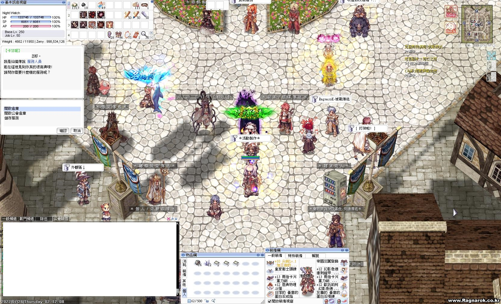
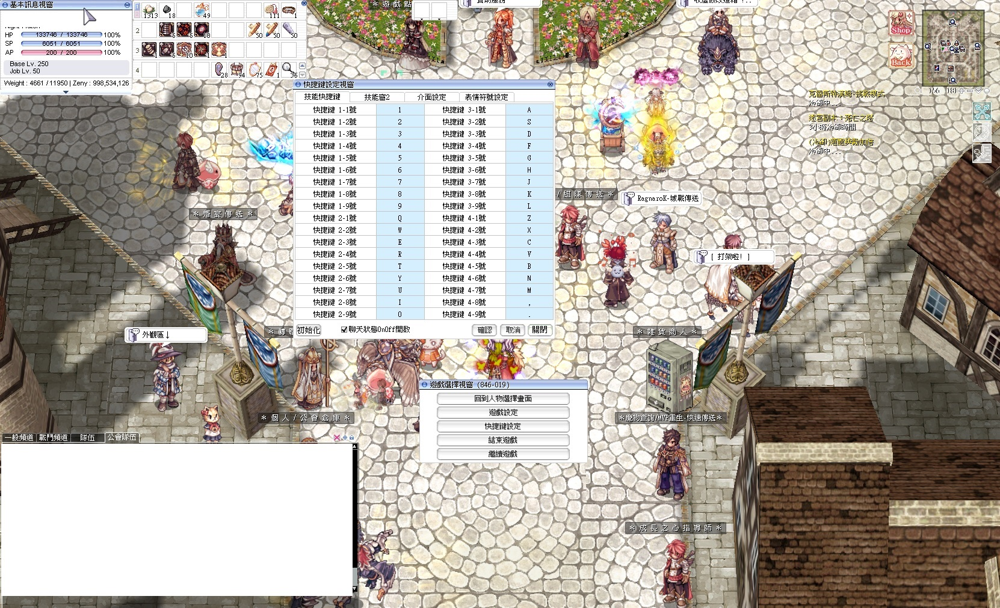
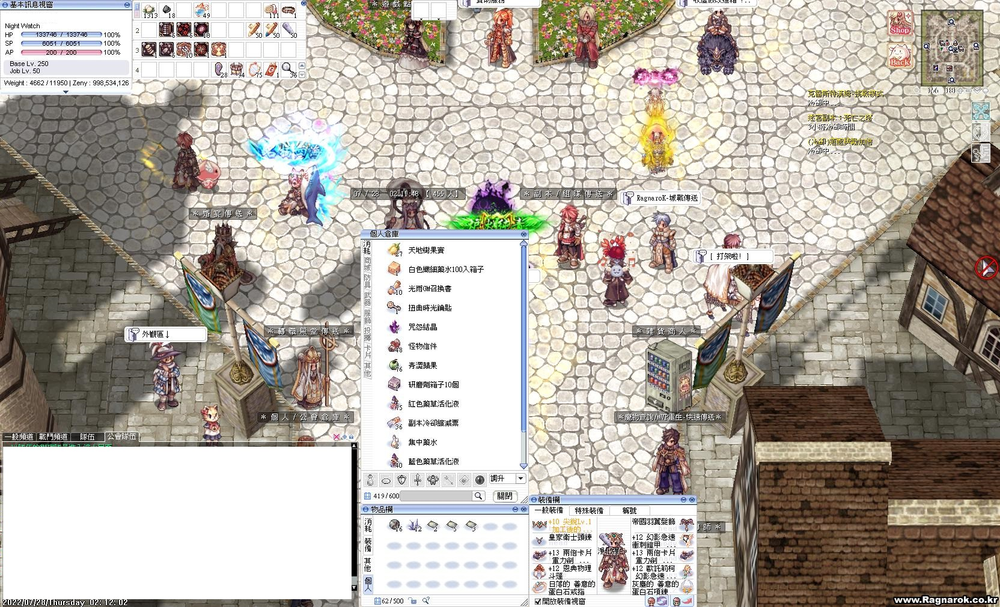
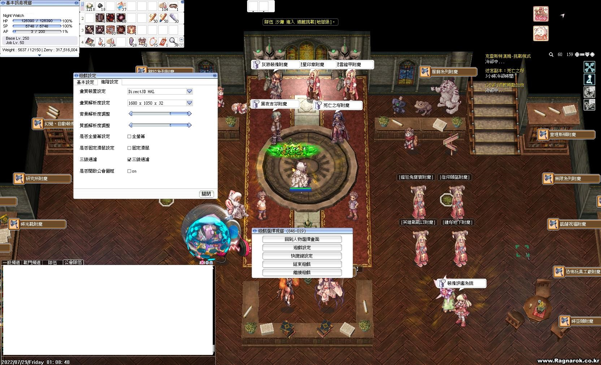

# RO_SF_LightRain
For RO SF LightRain QuickMacroPortable_9 QMscripts
## Setting Note

## Release Note

### 20220910A
月餅_v1.Q [20220910A]
1. Optimize
百館_v1.Q [20220910A]
1. 增加開館手

### 20220909A
月餅_v1.Q [20220909A]
1. Add script(For 9/9~9/18活動)

### 20220908A
百館_v1.Q [20220908A]
1. Add script
2. Judge the map the attack

### 20220904B
刷材料_v5.Q [20220904B]
1. Copy from 刷材料_v4.Q [20220904A]
2. Add Multiple Process Feature, can run up to 3 charator with the same behavior

ModifyWindowName_v1.Q [20220904A]
1. Add ModifyWindowName_v1.Q to modify the window name for 刷材料_v5.Q

### 20220904A
刷材料_v4.Q [20220904A]
1. Modify Auto Store with Alt+RightClick

### 20220901A
霸肋門附魔_v1.Q
1. Add Enchant Type

### 20220829A
刷掉寶券_v1.Q [20220829A]
1. Rename to 刷掉寶券_v1.Q
2. Optimize

202208

### 20220828B
刷經驗券_v1.Q [20220828A]
1. Add Script
2. Please confirm all settings are correct.

### 20220828A
刷材料_v4.Q [20220828A]
1. Fix the second verify problem

### 20220825A
Autoloot_v1.Q [20220825A]
1. Add gEnLootIdGroup_StarTower(星座之塔)

### 20220816A
Autoloot_v1.Q [20220816A]
1. Add enter delay before and after the enter key in

### 20220815B
刷材料_v4.Q [20220815B]
1. Add script timer, will go home and stop the script when timeout.
DropItem_v1.Q [20220814A]
1. Add window shift

### 20220814A
Autoloot_v1.Q [20220814A]
1. Add gEnLootIdGroup_Weekend, the enable loot type 0 2 3 6
刷材料_v4.Q [20220814A]
1. Add support 2 and trigger timer
2. Add gTrigSupport1AtBeginning and gTrigSupport2AtBeginning to toggle the support at beginning

### 20220813B
Autoloot_v1.Q [20220813B]
1. Optimize gEnLootIdGroup_Bossnia

### 20220813A
Autoloot_v1.Q [20220813A]
1. Add gEnLootIdGroup_Bossnia(波士尼亞)

### 20220812A
DropItem_v1.Q [20220812A]
1. Add script to auto drop the item when drilling.
刷材料_v4.Q [20220812A]
1. Update some string

### 20220811A
霸肋門附魔_v1.Q v[20220809A]
1. Add script 霸肋門附魔_v1.Q

### 20220806B
刷材料_v4.Q v[20220806B]
1. Add support 1 and trigger timer

### 20220806A
刷材料_v4.Q v[20220806A]
1. Add support 1 and trigger timer

### 20220804A
1. Add First Github version
	- 連點左鍵_v1.Q: v[20220725A]
    - Autoloot_v1.Q: v[20220804A]
	    - Add some loot id
	- 刷材料_v1.Q
	- 刷材料_v2.Q
	- 刷材料_v3.Q
	- 刷材料_v4.Q: v[20220804A]
		- Add opthin to support groung trigger skill
		

